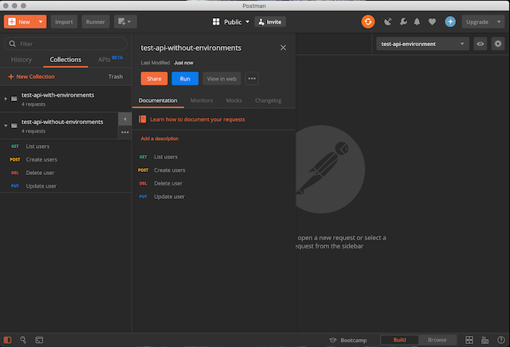
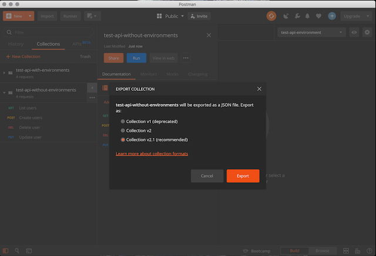
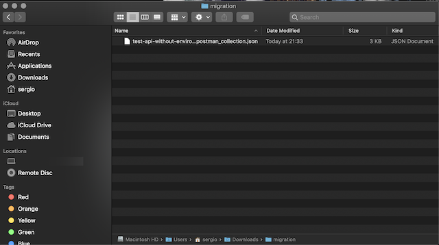
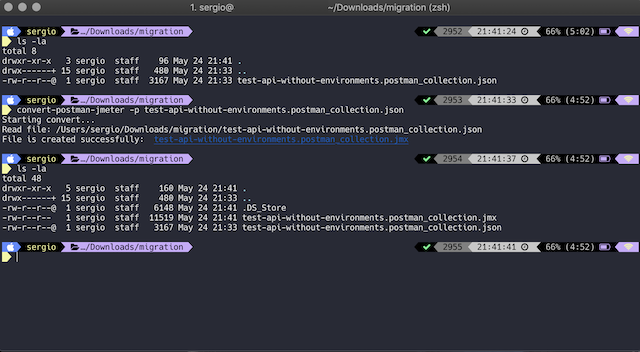
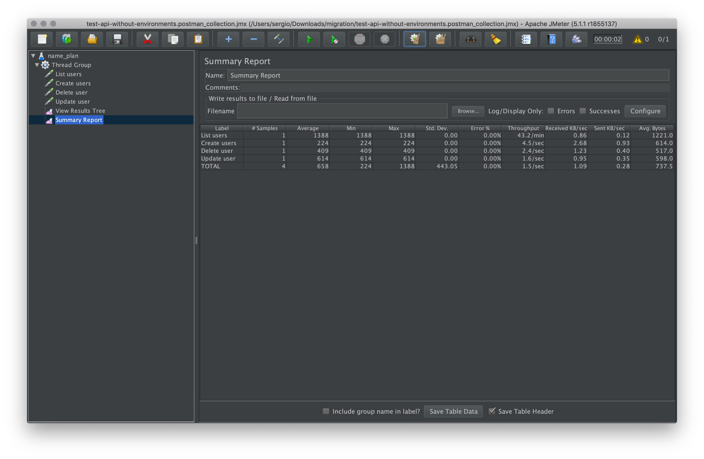

# convert-postman-jmeter
[](https://github.com/sercheo87/convert-postman-jmeter/actions/workflows/npm-publish.yml)


[](https://sonarcloud.io/dashboard?id=convert-postman-jmeter)

This tool convert projects [Postman](https://www.getpostman.com) to [JMeter](https://jmeter.apache.org)

- [NPM Site](https://www.npmjs.com/package/convert-postman-jmeter)
- [Wiki](https://sercheo87.github.io/convert-postman-jmeter/)

## Installation

```bash
npm i convert-postman-jmeter -g
```

## Usage

```bash
$ convert-postman-jmeter
Usage: convert-postman-jmeter -p [file] -j [file]

Options:
  --help          Show help                                            [boolean]
  --version       Show version number                                  [boolean]
  -p, --postman   Load project postman                                [required]
  -j, --jmeter    Output project JMeter
  -o, --override  Override project JMeter                       [default: false]
  -b, --batch     Export all projects postman from folder path     [default: ""]

Copyright 2021
```

### Options

    -p,--postman        File name of project Postman exported.

    -j,--jmeter         File name to output generated project JMeter.

    -o,--override       Override project JMeter generate if exists.

    -b,--batch          Export all projects postman from folder path.

## Example Use

Open Postman:



Export project:



Save file:



Convert project exported:

```bash
convert-postman-jmeter -p test-api-without-environments.postman_collection.json
```

```bash
convert-postman-jmeter -b /projects-postman/
```



Open project generate with JMeter App :



## Known Issues

For issues create o find in [issues page](https://github.com/sercheo87/convert-postman-jmeter/issues).
